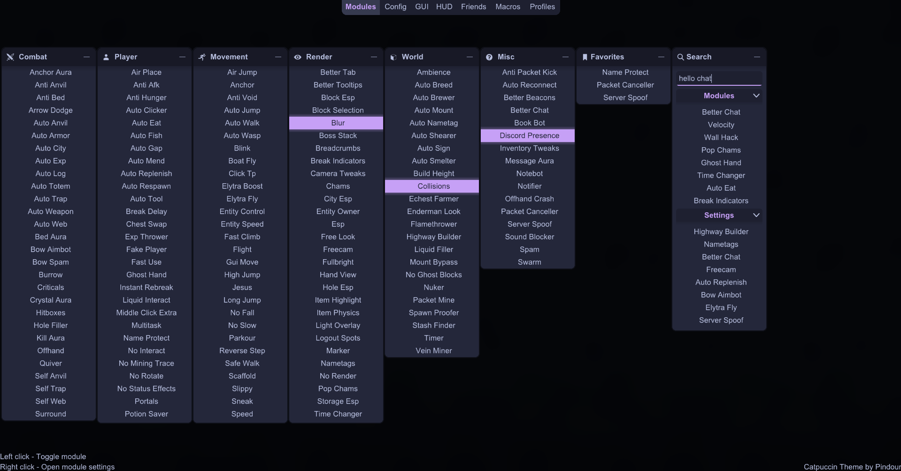
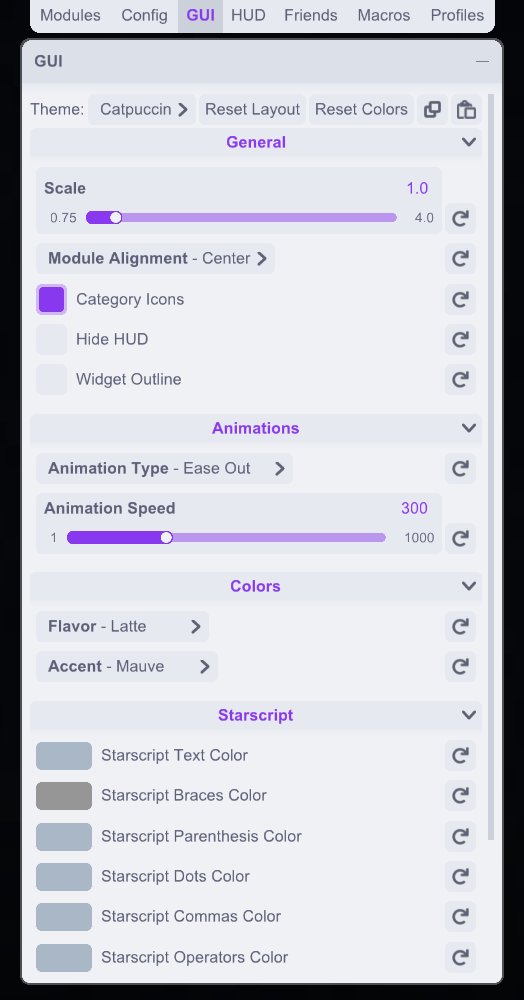
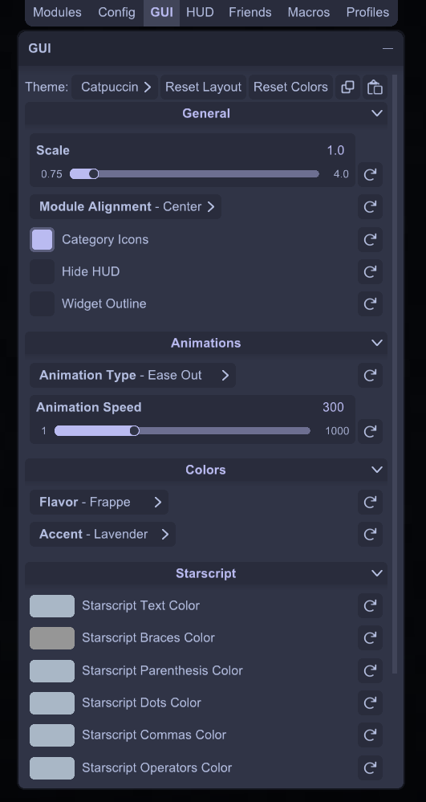
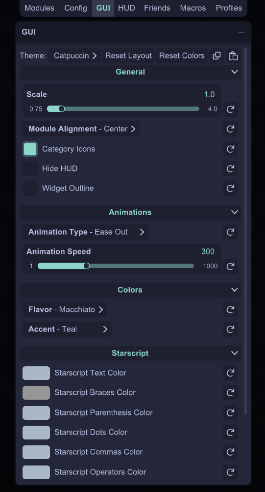
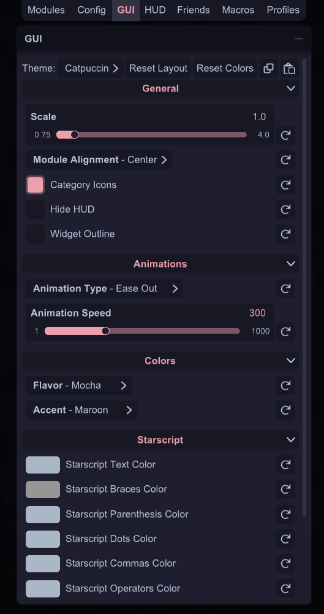

<h3 align="center">
   
  
  Catppuccin for <a href="https://meteorclient.com">Meteor Client</a>
  
</h3>

	
	
	
  

  

## 🖼️ Previews

🌻 Latte

 

🪴 Frappé

 

🌺 Macchiato

 

🌿 Mocha

 

## 🧰 Installation

> Requires [Meteor Client](https://meteorclient.com) (duh).

1. 🡒 Go to the [**Releases tab**](../../releases) and download the latest `.jar` file for your Minecraft version.
2. 🡒 Move the file into your `mods` folder.
3. 🡒 Launch Minecraft with Meteor Client.
4. 🡒 Open the **ClickGUI** (`Right Shift` by default).
5. 🡒 Go to the **"GUI"** tab and select the **"Catppuccin"** theme from the **"Theme"** dropdown.
6. 🡒 (Optional) In the **"Config"** tab, set your font to **Arial** or another one that supports multiple font styles (bold, italic...).

> 💡 *Pro Tip: Use the search bar in the releases tab to find your exact Minecraft version (e.g. "1.21.4 build").*

## ✨ Features

- 🟣 **Epic rounded corners**  
  *(Kinda janky, but that can be fixed later if I find a better way to do it)*

- 🌈 **Epic flavors** from the [Catppuccin Palette](https://catppuccin.com/palette/)  
  *(Latte, Frappé, Macchiato, Mocha)*

- 🌀 **Epic smooth animations**  
  *(Configurable duration and type: Linear, Ease In, Ease Out, etc.)*

- 🔤 **Epic font rendering**  
  *(Supports bold, italic, and dynamic font style switching)*

- 🧲 **Epic snap-to-grid for Modules Screen**  
  *(Keeps your GUI very epic looking and organized)*

> ⚠️ *I used some funny workarounds to make this work (see mixins). If you know a better way – hit me up!*

## 🛠️ Planned

- Fix bugs
- Custom hud elements (Module List, Status bar, Inventory, etc.)
- im buggin out

## 💬 Support
- You can find me on Meteor's discord (@Pindour) or join our freaky ahh [discord server](https://discord.gg/njM9JFPnT5).
- Or use GitHub issues, but I have no clue how those work so glhf

	

