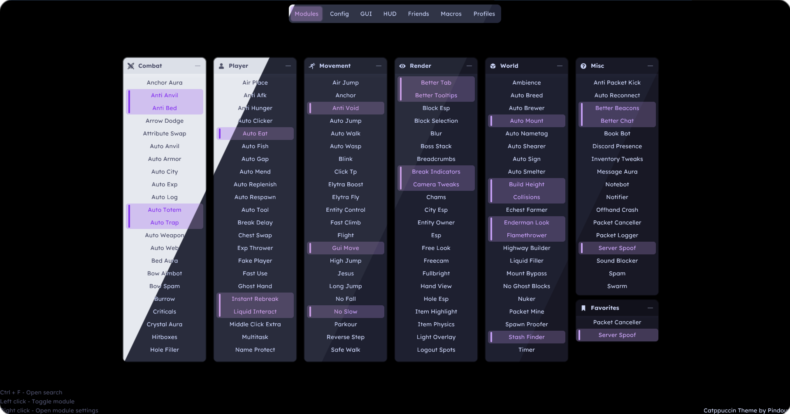
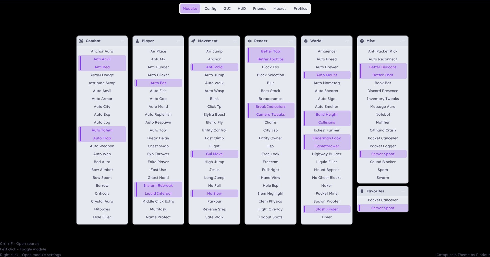
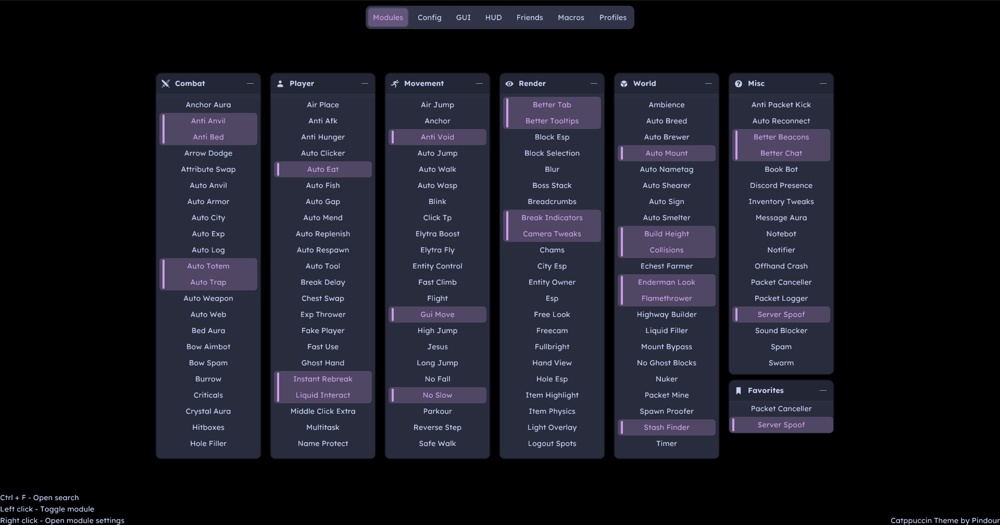
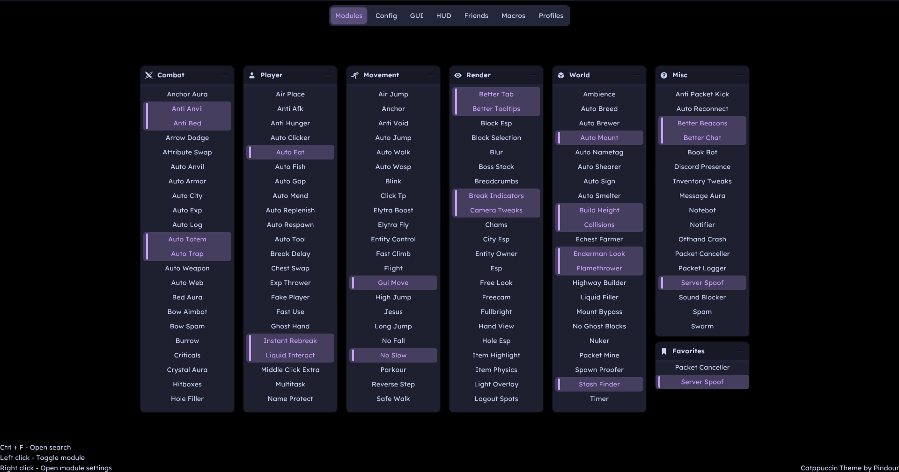
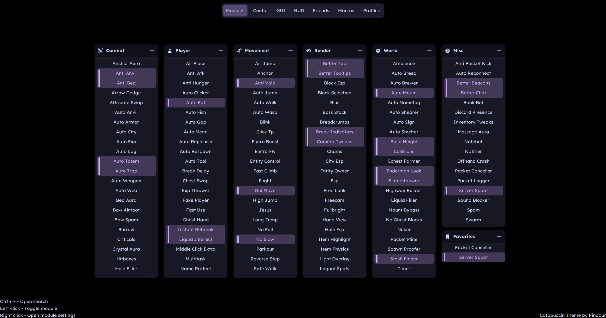

<h3 align="center">
  <br/>
  
  Catppuccin for <a href="https://meteorclient.com">Meteor Client</a>
  
</h3>

<div align="center">
  <a href="https://github.com/X-C-0/catppuccin-addon/stargazers"></a>
  <a href="https://github.com/X-C-0/catppuccin-addon/issues"></a>
  <a href="https://github.com/X-C-0/catppuccin-addon/contributors"></a>
  <a href="https://github.com/X-C-0/catppuccin-addon/releases"></a>

  <br>
  <h3>Download</h3>

  <a href="https://modrinth.com/mod/catppuccin-theme-addon"></a>
  <a href="https://github.com/X-C-0/catppuccin-addon/releases"></a>
  
  <sub>⚠️ <strong>Note:</strong> The links above are the <strong>only official download sources</strong>. Any other third-party websites or mirrors are unauthorized and contain malware/viruses.</sub>
  <br>
</div>

<p align="center">
  
</p>

## 🖼️ Previews

<details>
<summary>🌻 Latte</summary>
<br/>

</details>

<details>
<summary>🪴 Frappé</summary>
<br/>

</details>

<details>
<summary>🌺 Macchiato</summary>
<br/>

</details>

<details>
<summary>🌿 Mocha</summary>
<br/>

</details>

> Font used in previews: [Lexend Deca](https://fonts.google.com/specimen/Lexend+Deca)

## 🧰 Installation

> Requires [Meteor Client](https://meteorclient.com) (duh).

1. 🡒 Go to the [**Releases tab**](../../releases) and download the latest `.jar` file.
2. 🡒 Move the file into your `.minecraft/mods` folder.
3. 🡒 Launch Minecraft.
4. 🡒 Open ClickGUI (`Right Shift`), go to the **"GUI"** tab.
5. 🡒 Select **"Catppuccin"** from the **"Theme"** dropdown.
6. 🡒 **Recommended:** In the **"Config"** tab, set your custom font to **Arial** (or any font that supports bold/italic styles) for the full experience.

## ✨ Features

- 🟣 **Epic Rounded Corners™**  
  *(Powered by custom shaders and meshes. Perfectly smooth rounded corners with configurable radius)*


- 🌈 **Epic Flavors and Colors** from the [Catppuccin Palette](https://catppuccin.com/palette/)  
  *(Latte, Frappé, Macchiato, Mocha and all the colors)*


- 🌀 **Epic Smooth Animations™**  
  *(Configurable duration and easing, now even better and smoother after v2 update)*


- 🔤 **Epic Font Rendering™**  
  *(Supports bold, italic, and dynamic font style switching)*


- 🧲 **Epic Snap-to-Grid for Modules Screen™**  
  *(Keeps your GUI very epic looking and organized)*


- 🔎 **Epic Search™**  
  *(Leveraging advanced query-parsing technology to help you find 'AutoCrystal' 0.4ms faster)*

## 🛠️ For Developers

Want to add support for the Catppuccin Theme in your addon?

### Gradle Setup

Add the JitPack repository and the API dependency to your `build.gradle.kts`.

```kotlin
repositories {
    maven {
      name = "jitpack"
      url = uri("https://jitpack.io")
    }
}
```

```kotlin
dependencies {
    // Use the ':api' classifier to not include the whole theme in your addon
    // Note: Make sure '${mc_version}' matches your target Minecraft version (e.g. "1.21.1"),
    //       also replace '${catppuccin_version}' with the latest Catppuccin version (e.g. "2.0.0")
    include(modImplementation("com.github.X-C-0.catppuccin-addon:${mc_version}:${catppuccin_version}:api"))
    
    // Optional: Add the full theme to your runtime environment
    modLocalRuntime("com.github.X-C-0.catppuccin-addon:${mc_version}:${catppuccin_version}")
}
```

### Registering Custom Icons
If your addon adds new categories, you can register custom icons for them to match the theme style.

```java
// Check the javadocs for usage
CatppuccinIcons.registerCategoryIcon(categoryName, texture);
```

## 💬 Support

- Find me on Meteor's discord (`@Pindour`) or join my silly [Discord Server](https://discord.gg/njM9JFPnT5) if you want to hang out.
- Found a bug? Open an [Issue](https://github.com/X-C-0/catppuccin-addon/issues) (please include logs/screenshots).

<p align="center">
    
</p>
